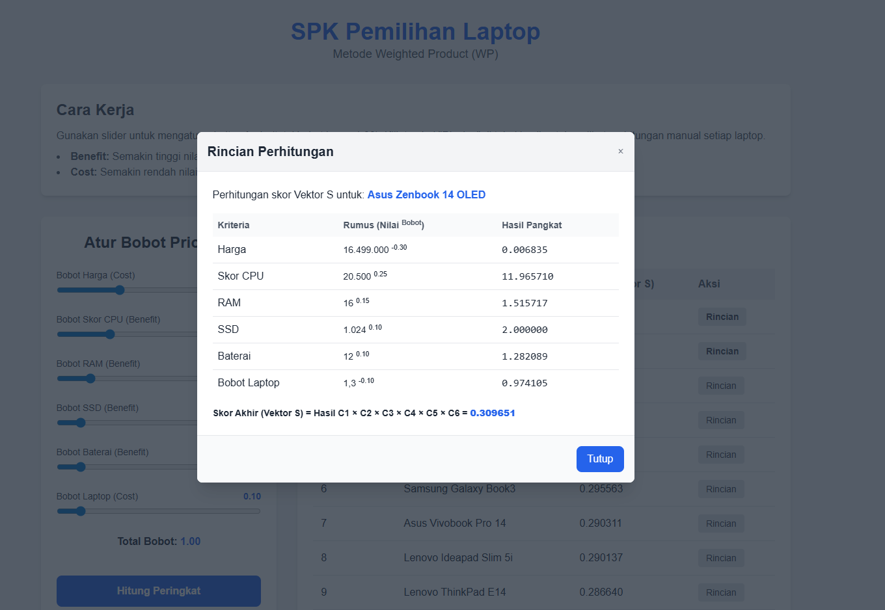

# Proyek SPK Pemilihan Laptop (Metode WP)

## 🖼️ Pratinjau Tampilan UI

### Tampilan Utama (Peringkat Dinamis)


### Rincian Perhitungan (Modal)


---

## 📋 Deskripsi Proyek

Aplikasi web **Sistem Pendukung Keputusan (SPK)** untuk merekomendasikan laptop terbaik bagi mahasiswa informatika. Aplikasi ini dibangun menggunakan:

• **Backend:** Python (Flask)  
• **Frontend:** JavaScript (Fetch API)  
• **Containerization:** Docker  

Metode SPK yang digunakan adalah **Weighted Product (WP)**.

---

## ✨ Fitur Utama

• **Peringkat Dinamis:** Pengguna dapat mengatur bobot (prioritas) untuk setiap kriteria secara interaktif menggunakan slider.

• **Perhitungan Transparan:** Tombol "Rincian" di setiap baris hasil menampilkan pop-up modal dengan rincian perhitungan (Nilai ^ Bobot) untuk setiap kriteria.

• **Frontend Responsif:** Tampilan modern dan responsif dibangun menggunakan Tailwind CSS, nyaman dibuka di desktop maupun mobile.

• **Backend API (Flask):** Backend Flask menyediakan API yang aman untuk perhitungan.

• **Database SQLite:** Data laptop disimpan dalam database SQLite (`laptops.db`) yang dibuat secara otomatis.

• **Otentikasi API Key:** Endpoint API `/api/calculate` dilindungi oleh API Key statis untuk mencegah penyalahgunaan.

• **Containerisasi Docker:** Seluruh aplikasi (Backend, Database setup, Frontend) dibungkus dalam satu image Docker yang siap dijalankan di mana saja dengan satu perintah.

---

## 💻 Tumpukan Teknologi (Tech Stack)

• **Backend:** Python 3, Flask, Gunicorn  
• **Database:** SQLite3  
• **Frontend:** HTML, JavaScript (Fetch API), Tailwind CSS  
• **DevOps:** Docker, Docker Compose  

---

## 🚀 Cara Menjalankan Proyek

Ada dua cara untuk menjalankan proyek ini. **Metode Docker** adalah yang paling direkomendasikan.

---

### Metode 1: Docker (Direkomendasikan) 🐳

Metode ini akan membangun dan menjalankan aplikasi di dalam container yang terisolasi. Ini adalah cara "produksi".

**Langkah-langkah:**

1. Pastikan Docker Desktop sudah ter-install dan sedang berjalan.

2. Buka terminal (CMD, PowerShell, atau Bash) sebagai Administrator.

3. Pindah (`cd`) ke folder proyek ini.

4. **Build Image Docker:**
   ```bash
   docker build -t spk-laptop-app .
   ```
   
   *Jika ada cache lama, gunakan:*
   ```bash
   docker build --no-cache -t spk-laptop-app .
   ```

5. **Run Container:**
   ```bash
   docker run -p 5000:5000 spk-laptop-app
   ```

6. Buka browser dan kunjungi: `http://localhost:5000`

---

### Metode 2: Manual Lokal (Development/Debug) 🛠️

Metode ini menjalankan server secara langsung di komputermu menggunakan Python venv.

**Langkah-langkah:**

1. **Buat & Aktifkan Virtual Environment:**

   ```bash
   # Buat venv
   python -m venv venv
   
   # Aktifkan venv (Windows)
   .\venv\Scripts\activate
   
   # Aktifkan venv (Linux/Mac)
   source venv/bin/activate
   ```

2. **Install Dependencies:**
   ```bash
   pip install -r requirements.txt
   ```

3. **Buat Database (Wajib, 1x saja):**
   
   Script ini akan membuat file `laptops.db` dan mengisinya dengan data.
   ```bash
   python database.py
   ```

4. **Jalankan Server Flask:**
   ```bash
   python app.py
   ```

5. Buka browser dan kunjungi: `http://localhost:5000`

---

## 📝 Lisensi

MIT License
 ```
Copyright (c) 2025 Dimas Tri M

Permission is hereby granted, free of charge, to any person obtaining a copy
of this software and associated documentation files (the "Software"), to deal
in the Software without restriction, including without limitation the rights
to use, copy, modify, merge, publish, distribute, sublicense, and/or sell
copies of the Software, and to permit persons to whom the Software is
furnished to do so, subject to the following conditions:

The above copyright notice and this permission notice shall be included in all
copies or substantial portions of the Software.

THE SOFTWARE IS PROVIDED "AS IS", WITHOUT WARRANTY OF ANY KIND, EXPRESS OR
IMPLIED, INCLUDING BUT NOT LIMITED TO THE WARRANTIES OF MERCHANTABILITY,
FITNESS FOR A PARTICULAR PURPOSE AND NONINFRINGEMENT. IN NO EVENT SHALL THE
AUTHORS OR COPYRIGHT HOLDERS BE LIABLE FOR ANY CLAIM, DAMAGES OR OTHER
LIABILITY, WHETHER IN AN ACTION OF CONTRACT, TORT OR OTHERWISE, ARISING FROM,
OUT OF OR IN CONNECTION WITH THE SOFTWARE OR THE USE OR OTHER DEALINGS IN THE
SOFTWARE.
 ```
